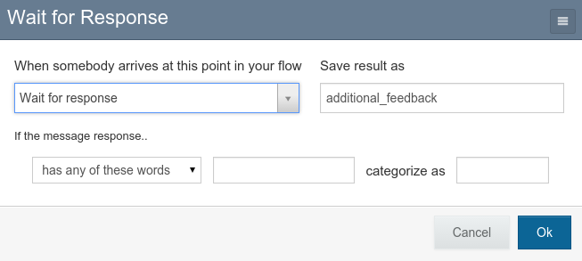
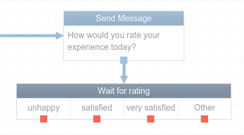

Question types
==============

TracPro questions are classified as either categorical or open-ended. Question
type is determined by how the flow variable is set up on RapidPro.

Open-ended questions
--------------------

To set up an open-ended question, do not change the default choices in the
"If the message reponse..." section on RapidPro.

Your question will look like this on the flow editor:

.. image:: ../images/open-ended-display.png

Data for open-ended questions is displayed as a word cloud.

Categorical questions
---------------------

To set up a categorical question, define categories for your responses on
RapidPro.

.. image:: ../images/categorical-setup.png

Your question will look like this on the flow editor:

Data for categorical questions is displayed as a pie chart.
