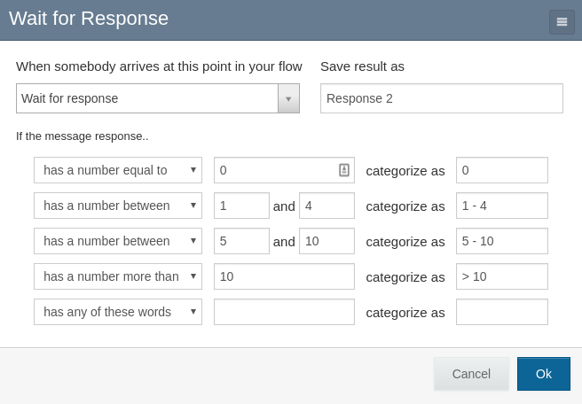
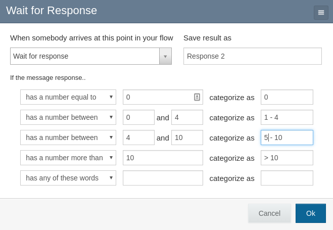

Designing Flows
===============

This section addresses additional design considerations for users who are
building RapidPro flows that will be imported as TracPro polls.

See the `RapidPro knowledge base <http://knowledge.rapidpro.io/>`_
for detailed instructions on how to use the RapidPro flow editor tool.

Rules
-----

Rules are the directives that categorize a contact's responses to an SMS
message. A rule set is the ordered group of rules that are applied to a
response; the first applicable rule determines the response's category and
therefore the next step the user will visit in the flow.

RapidPro flow steps correspond with TracPro questions. TracPro stores the rules
that are associated with the flow step in order to determine all answer
categories that are available for the question. In the case of numeric
questions, TracPro uses the rules to categorize calculated values, for example
to determine the category of the question's average answer.

Numeric rules
-------------

Several rule types address numeric input:

    If the message response...

        * is a number
        * has a number equal to X
        * has a number greater than X
        * has a number less than X
        * has a number between X and Y

The `between` test is inclusive of its endpoints - that is, the rule
*has a number between 5 and 10* would match the inputs "5" and "10". The
`greater than` and `less than` tests are not inclusive - that is, neither
*has a number greater than 5* nor *has a number less than 5* would match the
input "5".

When numeric input is expected, flow designers should determine the minimum
and maximum valid values and ensure that all possible numeric within the range
is covered. Even if you only expect integer responses, you should design
rules that can categorize arbitrary values, for example the average answer
value.

Consider this common rule set description:

    * If the response is a number equal to 0, then categorize as "zero"
    * If the response is a number between 1 and 4, then categorize as "1-4"
    * If the response is a number between 5 and 10, then categorize as "5-10"
    * If the response is a number greater than 10, categorize as "11+"
    * Otherwise, categorize as "Other"

This set-up will work well when collecting data from contacts. However, if
the average value calculated on TracPro is 0.5 or 4.5, then it will be
categorized as "Other". To prevent this situation while maintaining the
intended meaning for integer input, adjust the categories above:

    * If the response is a number equal to 0, then categorize as "zero"
    * If the response is a number between 0 and 4, then categorize as "1-4"
    * If the response is a number between 4 and 10, then categorize as "5-10"
    * If the response is a number greater than 10, then categorize as "11+"
    * Otherwise, categorize as "Other"

