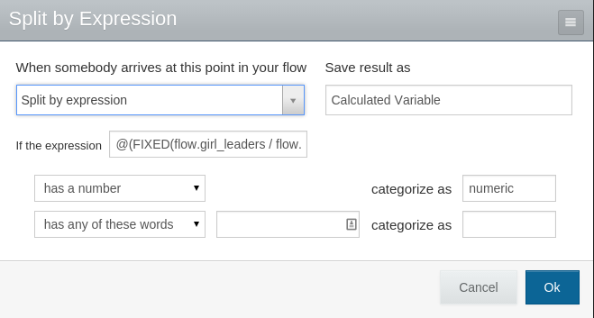
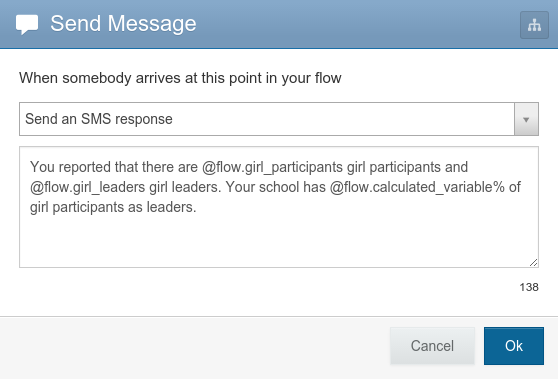
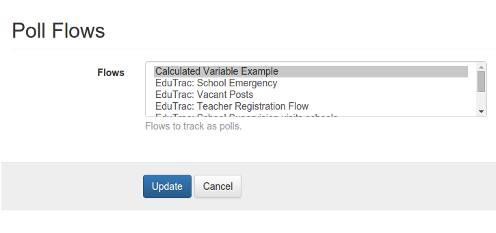
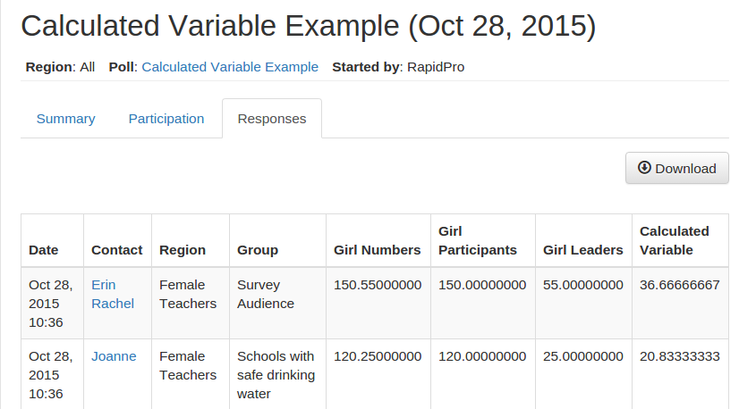

Getting Started
======================

The following steps take you through the process of creating a new organization in TracPro. If you are using your local development installation, then ensure that both the web server and Celery are running.

Preparing RapidPro
-----------------------

Before setting up your TracPro organization, one should ensure that the RapidPro organization has the following:

* A set of contact groups representing panels, e.g. *Kigali*, *Florida*
* A set of contact groups representing cohorts, e.g. *Males*, *Teachers*

Obviously you will also want to define some flows in RapidPro which are suitable for running as polls.

Creating An Organization In TracPro
------------------------------------

 * Navigate to http://localhost:8000/
 * Log in as a superuser
 * Navigate to http://localhost/manage/user/ and add a new administrator user account
 * Navigate to http://localhost/manage/org/ and click *Add* to create a new organization
 * Include the newly created user as an administrator
 * Use the API token provided by your RapidPro organization. If you don't know it then visit the `API explorer <https://app.rapidpro.io/api/v1/explorer>`_.
 * Save new org and navigate to http://SUBDOMAIN.localhost:8000/ where SUBDOMAIN is the subdomain of your new organization
 * Log in as the new administrator user

Configuring An Organization
----------------------------

There won't be much to see until you tell TracPro about which flows and groups to use.

 * Navigate to **Administration** > **Polls** and click **Select** to select which flows in RapidPro will be used as polls in TracPro
 * Navigate to **Administration** > **Cohorts** and click **Select** to select which contact groups in RapidPro will be used as cohorts in TracPro
 * Navigate to **Administration** > **Panels** and click **Select** to select which contact groups in RapidPro will be used as panels in TracPro. This will trigger a fetch of all contacts from those groups.

Fetching old runs
------------------

If a new poll is added, TracPro will only track runs made after the poll has been added.
If you need to fetch older runs, then there is a button which allows you to do this.

 * Navigate to `http://SUBDOMAIN.yourtracprodomain/`.
 * Navigate to **Administration** > **Organization** and click **Fetch runs** (on the right side near the top).
 * Enter how many days in the past the fetch should go. For example, to fetch runs from the last two weeks, enter 14.
 * Click **Submit**.

**One should use this command with caution as it could potentially try to download a very high number of runs**

Displaying Calculated Values on Tracpro
---------------------------------------
You can display values that are calculated from user responses on Tracpro. We reference an :download:`example flow <../files/calculated-variable-example.json>` that uses a calculated variable from results of a `structured message form <http://knowledge.rapidpro.io/knowledgebase/articles/716520-split-by-message-form>`_.

**In RapidPro**: After you have built your flow to collect variables that you wish to use for the calculation, add a “Split by Expression” step.

Save the result as a particular variable name, for example `Calculated Variable`.
Write the expression to calculate the variable, for example `@(flow.girl_leaders / flow.girl_participants * 100)`. You have access to basic math, `expressions <http://knowledge.rapidpro.io/knowledgebase/topics/88968-syntax-guide>`_, and `variables <http://knowledge.rapidpro.io/knowledgebase/articles/595248-variables-in-a-flow>`_.

**In RapidPro**: You can use the calculated variable like any other variable, for example in a response to the user.

**In TracPro**: To view on Tracpro, ensure that your poll has been added through the Poll Flows chooser.

**In TracPro**: Your calculated variable will be available as a Question on Tracpro. You can view and use it exactly as you would any other Question.

- To view the numeric responses, including those for the calculated variable:
- View the Poll.
- Click on the “Dates” tab.
- Select the date of the poll you wish to see.
- Click on the “Responses” tab.

